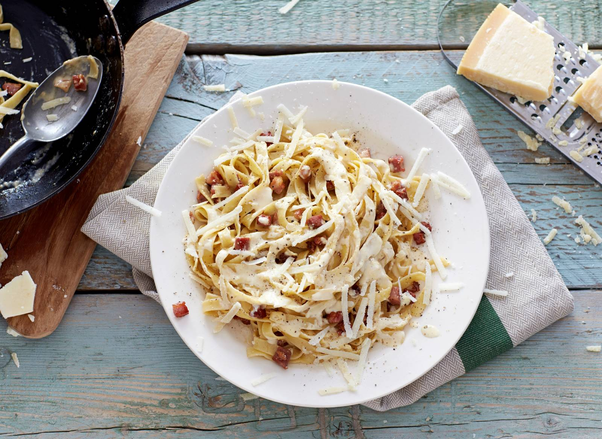

# Pasta carbonara met room

![cabonara]:https://static.ah.nl/static/recepten/img_063116_1600x_JPG.jpg

## Benodigheden
50 g
Pecorino Romano
50 g
Parmigiano Reggiano
2 middelgrote eieren
250 ml
verse slagroom
300 g
tagliatelle all'uovo
2 el
traditionele olijfolie
250 g
gerookte spekblokjes

## Bereiding 
 1. Rasp de Pecorino en de Parmezaanse kaas. Klop de eieren los met de slagroom. Voeg 1 el Pecorino Romano, 1 el Parmezaanse kaas (per 4 personen) en wat peper toe. Kook de tagliatelle volgens de aanwijzingen op de verpakking, maar trek 2 min. van de kooktijd af. Giet af, maar vang het kookvocht op.
 2. Verhit ondertussen de olie in een grote koekenpan en bak de spekblokjes met nog wat peper op middelhoog uur in 8 min. bruin. Voeg een soepopscheplepel kookvocht van de tagliatelle toe. Schep de tagliatelle bij het spek in de pan en roer snel op hoog vuur om. Schenk het ei-slagroom mengsel en nog een soepopscheplepel kookvocht bij de tagliatelle. Schep nog 2 min. snel om op hoog vuur. Verdeel over de borden en strooi de rest van de Parmezaanse kaas en de Pecorino erover. Serveer direct.
